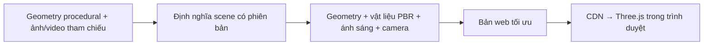

# Architecture Decision — Chất lượng kiến trúc 3D cho B2B

Ngày: 07/10/2026. Trạng thái: đã triển khai renderer/model trong workspace và build xuất tĩnh thành công; chưa publish/deploy, chưa đo trên điện thoại thật.

Phạm vi đã chốt: nâng chất lượng model 3D tương tác. Media hiện có chỉ là nguồn đối chiếu kiến trúc; không có đầu ra video mới trong thay đổi này.

## 1. Hiểu bài toán và nguồn hiện có

Mục tiêu là làm công trình thuyết phục hơn khi doanh nghiệp đánh giá địa điểm: kính có phản xạ, mặt tiền có chuyển sắc, khe cửa có chiều sâu và khung hình làm nổi bật kiến trúc. Chất lượng này phải ổn định trên thiết bị khách hàng và được phân phối bằng tài nguyên tĩnh, không cần server render cho từng lượt xem.

Người dùng xác nhận nguồn ban đầu chỉ có model và media trong repo. Hình học được dựng bằng code trong [model.ts](../src/app/model-3d/model.ts), không có CAD, GLB, scene Blender hay bộ texture PBR gốc. Tỷ lệ `112 × 26 × 24` là ước lượng; mô hình không phải bản vẽ khảo sát. Bản này bổ sung một HDRI trời có nguồn/giấy phép trong [ASSET-LICENSE.md](../public/model-3d/ASSET-LICENSE.md).

Đã đối chiếu ảnh trước/sau ở desktop 1440 × 1000 và viewport mobile 390 × 844, đồng thời xem poster công trình. Bảng dưới ghi nhận **snapshot trước thay đổi**, không phải cấu hình renderer mới. Kiểm tra viewport trong trình duyệt không thay thế đo hiệu năng trên điện thoại thật.

| Hiện trạng | Bằng chứng | Hệ quả thiết kế |
| --- | --- | --- |
| Phản xạ môi trường yếu | [viewer.tsx](../src/app/model-3d/viewer.tsx): `scene.environmentIntensity = .08`; môi trường chỉ có `Sky` qua PMREM | Hiệu chỉnh ánh sáng môi trường trước khi chỉnh màu kính. Trong Three.js đang cài, khi vật liệu dùng `scene.environment`, giá trị scene này thay giá trị uniform từ `material.envMapIntensity`; hai giá trị không nhân nhau. |
| Bóng khó thể hiện chi tiết nhỏ | Shadow 2048, vùng chiếu 240 × 220 đơn vị, `normalBias = .08`; mullion rộng .05–.065 đơn vị | Một texel bóng theo chiều ngang phủ khoảng .117 đơn vị. Vùng bóng quá rộng so với chi tiết; cần fit vùng bóng và bias theo geometry, không chỉ tăng độ phân giải. |
| Kính thiếu không gian phía sau | Khối đặc toàn công trình ở `model.ts:141`, kính phía trước ở `143–144` | Tăng transmission vẫn nhìn vào bề mặt khối đặc. Cần thiết kế lại lớp vỏ và khoảng lùi phía sau kính. |
| Mặt trắng và cảnh quan giống sa bàn | Mặt tiền dùng BoxGeometry cạnh sắc, một map hạt 128 × 128 dùng cho bump/roughness; cây là Icosahedron; đường kết thúc bằng cạnh phẳng rõ | Vật liệu, cấu tạo mép, cây và bố cục phải cùng đạt chất lượng; chi tiết thêm riêng lẻ không đủ. |
| Góc “Mặt tiền” đang ưu tiên tổng thể | `fitView()` bao gồm tượng và đặt camera cao; khoảng nền đường chiếm phần lớn ảnh | Cần một preset kiến trúc gần hơn, đồng thời giữ preset tổng thể để hiểu vị trí. |
| Media thiếu chi tiết nguồn | Metadata video: 960 × 540, 159.809 giây, 26,427,417 bytes. Poster: 1440 × 810 | Chuyển file 540p thành 1080p/4K không tạo thêm chi tiết đáng tin cậy. Với nguồn hiện có, tối ưu cách trình bày và giữ file nguồn; chất lượng HD thật phụ thuộc tư liệu mới. |

Poster công trình cho thấy kính phía trên thực sự tối màu. Chuẩn thị giác là giữ sắc kính đã được quan sát, tạo biến thiên phản xạ theo góc nhìn và làm rõ cấu tạo mặt tiền. Không có căn cứ để đổi toàn bộ mặt kính thành kính trong hoặc tự thêm nội thất đã hoàn thiện.

## 2. Thiết kế được chọn

**Giữ Three.js và nâng model procedural hiện có.** Geometry, vật liệu, ánh sáng, camera và tài nguyên web được quản lý cùng phiên bản. Không thêm dependency: dùng addon của phiên bản Three.js đang cài. Lý do chọn là giải quyết trực tiếp cấu tạo và ánh sáng của công trình, giữ điểm chọn tầng và khả năng phân phối tĩnh.

Repo hiện dùng Next.js `output: "export"`. Geometry được tạo và render trên thiết bị khách; HDRI được tải cùng tài nguyên tĩnh của ứng dụng. Viewer không cần DB, server render hoặc dịch vụ GPU cho từng lượt xem.

### Cấu trúc model và vật liệu

1. Tách cấu tạo mặt tiền thành lớp che trắng, khung nhôm, kính, khoảng lùi và kết cấu phía sau. Thay phần khối đặc chặn kính bằng lớp vỏ tại những khu vực cần thể hiện chiều sâu. Các sàn và khoảng rỗng phục vụ render vẫn là minh họa khi chưa có bản vẽ chính thức.
2. Tạo mép và bevel nhỏ theo chi tiết quan sát được để bắt sáng. Giữ nhịp khe cửa theo tư liệu hiện có; không tự tạo lưới panel mới hoặc thêm công năng thương mại.
3. Giữ kính là vật liệu điện môi, dùng Fresnel và phản xạ môi trường. Hiệu chỉnh IOR, roughness, tint và transmission riêng cho kính tầng trên và kính storefront. Transmission chỉ có ý nghĩa khi hình học phía sau phù hợp.
4. Mặt trắng cần bộ thông tin màu, normal và roughness có tỷ lệ vật lý nhất quán; tránh dùng một map ngẫu nhiên cho mọi chất liệu. Có thể dùng texture procedural được tạo ngoại tuyến hoặc tài nguyên có giấy phép phù hợp, rồi hiệu chỉnh theo màu và độ nhám của công trình.
5. Phân loại mesh theo vai trò render: kết cấu đặc, kính, mặt nền, cây và các điểm chọn tầng. Batching theo vật liệu và vùng chỉ thực hiện sau khi giữ được vai trò này. Bóng kết cấu phải rõ; kính truyền sáng không mặc định đổ bóng đặc như bê tông.

Vật liệu PBR không tự chứng minh đúng công trình. Ảnh/video hiện có là mốc kiểm tra màu, cấu tạo và bố cục; mọi phần không đủ bằng chứng vẫn mang provenance `estimated`.

### Ánh sáng và chiều sâu

- Dùng một môi trường ngoài trời có dải sáng phù hợp qua `HDRLoader`/`EXRLoader` và `PMREMGenerator`, hoặc hiệu chỉnh sky procedural có kiểm soát. HDRI dùng cho phản xạ phải có nguồn và giấy phép; bối cảnh hiển thị cần phù hợp với tư liệu địa điểm.
- Cân bằng ánh sáng trời, ánh sáng trực tiếp và exposure cùng nhau. Giữ mặt trắng có chi tiết vùng sáng và phần lõm có chuyển sắc; tăng exposure toàn cảnh không giải quyết việc kính thiếu phản xạ.
- Fit shadow camera vào vùng công trình và nền cần nhận bóng. Nếu cả khu đất và mặt tiền cận đều cần chất lượng cao, dùng các vùng/cascade có ngân sách rõ; không duy trì một vùng rất rộng cho mọi góc nhìn.
- Dùng AO tiết chế để tăng bóng tiếp xúc ở khe và chân cấu kiện. AO không thay ánh sáng gián tiếp hoặc hình học thật. Với cảnh tĩnh, AO được bake vào tài nguyên là lựa chọn cho thiết bị yếu; UV và texture bake phải được quản lý trong pipeline.
- GTAOPass là lựa chọn bổ sung cho thiết bị đủ khả năng. Cần bỏ kính khỏi depth/normal **và** kiểm soát vùng nhận AO khi composite. Chỉ ẩn kính trong prepass vẫn có thể làm ảnh kính nhận AO từ geometry phía sau.

### Camera, cảnh quan và cảm giác cao cấp

Góc mặc định đưa công trình thành chủ thể: góc ba phần tư gần mặt tiền, nhìn rõ khung và khe lõm. Preset tổng thể giữ quan hệ với hồ và nút giao; các góc mặt hồ/mặt bên vẫn còn. Camera fit theo aspect của viewport; giới hạn vị trí camera để không xuyên công trình hoặc đi dưới nền.

Khung hình tránh lộ cạnh kết thúc của nền sa bàn. Nền đường, cây và cảnh phía sau phải có tỷ lệ, vật liệu và độ chi tiết tương xứng với công trình, dựa trên bối cảnh đã quan sát. Một phần cây/nền được quản lý bằng instancing hoặc LOD để giữ ngân sách GPU. Không thêm người, thương hiệu thuê hoặc nội thất như thông tin dự án đã xác nhận.

### Thư viện và ngân sách render

| Lựa chọn | Quyết định | Trade-off |
| --- | --- | --- |
| Three.js hiện có, HDR/EXR loader, PMREM | Nền tảng được chọn | Ít thay đổi hệ thống; chất lượng phụ thuộc scene và tài nguyên được chuẩn hóa. |
| EffectComposer, GTAOPass, OutputPass, AA từ `three/addons` | Dùng khi pass bổ sung giải quyết nhu cầu đã xác định | Tốn thêm bộ đệm và GPU; phải xử lý kính, color space và resize đúng. |
| React Three Fiber / drei | Chưa cần chuyển để đạt mục tiêu thị giác này | Có thể cải thiện cách tổ chức scene trong React, nhưng vẫn cần đúng geometry, vật liệu và ánh sáng. |

Baseline có thể tiếp tục render trực tiếp với antialias khi chưa dùng composer. Khi dùng composer, `antialias: true` của renderer không tự khử răng cưa các render target trung gian. Hai cấu hình cần chọn theo mục tiêu: `RenderPass → GTAOPass → OutputPass → FXAAPass`, hoặc `RenderPass → GTAOPass → SMAAPass → OutputPass`; cấu hình cuối cần render lại khi texture phụ của SMAA tải xong. Không mặc định bật mọi hiệu ứng.

Viewer giữ cơ chế render khi có thay đổi. Tải environment/texture, chuyển chất lượng, đổi camera và hoàn tất asset phải yêu cầu render lại. Geometry và resource GPU có vòng đời rõ; dispose cả target/passes khi đóng viewer.

Ngân sách đã áp dụng: HDRI 1K (1,173,154 bytes), DPR tối đa 1.6 ở viewport hẹp và 1.8 ở desktop, shadow 2048/4096 theo viewport. Khi trình duyệt báo `deviceMemory < 4`, bỏ AO/MSAA và giới hạn DPR 1.25. API này không có ở mọi trình duyệt; đây là heuristic, chưa phải phép đo năng lực GPU. Bóng ánh sáng tĩnh được cache, thay đổi được gộp vào một frame và không có vòng render khi đứng yên. Chưa công bố kết quả fps.

### Nguồn tham chiếu và tài nguyên có phiên bản

Giữ media hiện có làm nguồn đối chiếu sắc kính và nhịp kiến trúc. HDRI bầu trời dùng cho nền/ánh sáng/phản xạ, không đại diện ảnh chụp tại địa điểm dự án. Asset có tên hash và hồ sơ CC0; ứng dụng không tải tài nguyên từ bên thứ ba lúc khách xem. Cache immutable/HTTPS là cấu hình hosting cần kiểm tra khi publish, chưa được triển khai trong workspace.

Hợp đồng scene tối thiểu gồm: `sceneVersion`, nguồn/provenance, hệ trục Y-up và mặt tiền +Z, đơn vị ước lượng, geometry source, material profile, environment, camera presets, quality tiers, floor IDs và anchor theo tọa độ local của công trình. Giữ điểm chọn tầng độc lập với việc merge hoặc đổi bản xuất model. Hợp đồng này là đường chuyển sang CAD/GLB chính thức khi có tư liệu mới.

## 3. Validate security trước production

| Threat model | Kiểm soát trong thiết kế |
| --- | --- |
| Lộ bản vẽ, model hoặc metadata thương mại | Mọi GLB/texture được gửi đến trình duyệt đều có thể tải lại. Chỉ publish derivative đã duyệt; bỏ metadata nội bộ. Hợp đồng, hồ sơ doanh nghiệp và bản vẽ private giữ đường phân quyền trong [quyết định tài liệu R2](private-documents-r2.md). |
| Asset chứa URI ngoài hoặc dữ liệu làm quá tải decoder/GPU | Pipeline chỉ nhận nguồn được duyệt, giới hạn kích thước file/texture/geometry, kiểm tra URI và định dạng. Chạy chuyển đổi ở môi trường build giới hạn tài nguyên; không cho visitor chọn URI hoặc shader tùy ý. |
| Lỗi dependency hoặc tải mã từ CDN không kiểm soát | Pin phiên bản engine/addon/decoder tương thích, giữ lockfile và kiểm tra bản phát hành. Đóng gói decoder cùng tài nguyên triển khai; nguồn HDRI/PBR có hồ sơ giấy phép. |
| Cấu hình triển khai vô tình công khai dữ liệu hoặc cho phép thực thi rộng | Tách tài nguyên public và private; không có secret/token trong bundle hoặc manifest. CSP và nguồn image/media/worker cần khớp loader thực tế trên hosting production; decoder cần blob/worker thì cấp đúng phạm vi. HTTPS và cache được cấu hình ở CDN/hosting. |
| Khách hiểu hình render thành hồ sơ khảo sát hoặc hiện trạng kinh doanh | Giữ nhãn mô hình minh họa/tỷ lệ ước lượng và provenance. Duyệt những thay đổi hình học, nội thất, biển hiệu và cảnh quan trước khi trình khách; không để renderer tự tạo các khẳng định thương mại. |

Đây là threat model và các điều kiện triển khai, chưa phải kết quả kiểm tra bảo mật production. Public viewer không cần quyền đọc bucket private hoặc kết nối DB để render công trình.

## 4. Thay đổi đã triển khai và migration path

1. **Geometry/vật liệu:** thay khối đặc chặn kính bằng vỏ, sàn và cột proxy; thêm bevel nhỏ ở cấu kiện trắng; tách height/roughness, normal kính và tỷ lệ UV. Hai loại kính có transmission/tint/độ nhám riêng. Cây mặt tiền có tán lá, nền được mở rộng để hạn chế cạnh sa bàn. Tất cả cấu tạo bổ sung vẫn là minh họa.
2. **Renderer:** [rendering.ts](../src/app/model-3d/rendering.ts) sở hữu HDR/PMREM, ánh sáng, target và postprocessing. Chuỗi `RenderPass → AO composite → OutputPass → FXAA` có MSAA tối đa 4 mẫu. AO bỏ kính/cây/nước/decal ở depth/normal và kiểm tra depth của vật thể nhận AO để giữ phản xạ kính. Vòng đời dispose và phục hồi context tái tạo PMREM/bóng từ nguồn HDR giữ trên CPU.
3. **Tương thích web:** [viewer.tsx](../src/app/model-3d/viewer.tsx) giữ IDs tầng/anchor, chuyển góc, keyboard focus và thông tin công năng hiện có. Tài nguyên đi theo `assetBase`; model chạy trong export tĩnh. Trade-off là thêm khoảng 1.12 MiB tải lần đầu và nhiều bộ đệm GPU hơn; có fallback sky procedural khi HDR không tải được.
4. **Khi có CAD/GLB chính thức:** thay geometry qua `createModel()`/hợp đồng trục Y-up, mặt tiền +Z và `building` bounds; giữ IDs tầng/anchor. Duyệt chênh lệch tỷ lệ/cấu tạo/vật liệu trước khi thay nguồn ước lượng. Asset cũ và mới cần phát hành cùng bản bundle, rollback bằng release trước.
5. **Trước publish:** duyệt công khai tài nguyên, giấy phép, cấu hình hosting và đo thiết bị khách hàng. Chưa có hành động publish/deploy.

Tiêu chí thị giác: kính có biến thiên phản xạ nhưng giữ sắc tối theo tham chiếu; mặt trắng giữ chi tiết vùng sáng; khe cửa có bóng tiếp xúc; kính không đổ bóng đặc; công trình là chủ thể và mobile dùng được công năng/contact khi GPU lỗi. Ảnh trước/sau đã đối chiếu trong trình duyệt; chưa coi bản procedural là ảnh chụp hoặc hồ sơ khảo sát.

## 5. Kết quả kiểm tra local

- `tsc --noEmit --incremental false`: PASS.
- `npm run build`: PASS; static export có HDRI đúng hash và loại bỏ admin preview theo cấu hình hiện hành. UI package có warning directive `use client` của bundler, không làm build thất bại; không thay cấu hình package trong tác vụ 3D.
- `git diff --check` và detector Impeccable trên viewer: PASS, detector không có finding.
- Desktop 1440 × 1000, mobile 390 × 844: model render được, không có overflow ngang ở mobile; giới hạn DPR thể hiện trong kích thước canvas.
- Đổi góc, chọn tầng qua control/hotspot: cập nhật được scene và phần thông tin. Mất context: control tắt và có thông báo; restore: control bật, tầng đang chọn được giữ và frame GPU có dữ liệu pixel.
- Chưa đo fps, chưa nghiệm thu trên điện thoại thật hoặc tất cả trình duyệt, chưa xác nhận hosting production.

Nguồn kỹ thuật và giới hạn tương thích được ghi tại [3d-rendering-research.md](3d-rendering-research.md). Các nguyên tắc về vật liệu, môi trường và pass tham chiếu tài liệu chính thức [MeshPhysicalMaterial](https://threejs.org/docs/pages/MeshPhysicalMaterial.html), [Scene](https://threejs.org/docs/pages/Scene.html), [GTAOPass](https://threejs.org/docs/pages/GTAOPass.html), [OutputPass](https://threejs.org/docs/pages/OutputPass.html) và [FXAAPass](https://threejs.org/docs/pages/FXAAPass.html); tài nguyên CC0 tham chiếu [Poly Haven License](https://polyhaven.com/license).
