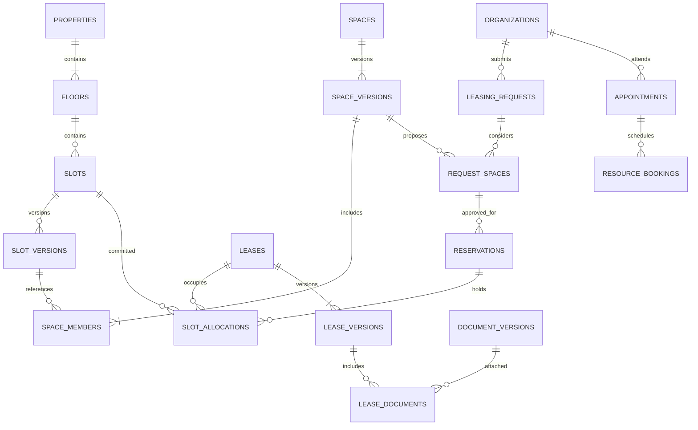

# Architecture Decision — Trung tâm thương mại B2B

Ngày: 06/10/2026. Nghiệp vụ đã chốt qua trao đổi với khách hàng.
Trạng thái: tài liệu thiết kế và SQL baseline draft; chưa apply DB, chưa triển khai
API/auth/Worker/R2 và chưa có chứng nhận tuân thủ hay kiểm thử runtime.

## 1. Hiểu

Khách là doanh nghiệp; người liên hệ, người dùng portal và người ký hợp đồng có
thể khác nhau. Trung tâm hiện có 6 tầng cố định. Khách cần xem diện tích, hướng,
phương án ghép slot, book lịch và gửi yêu cầu thuê.

### Quyết định đã chốt

| Chủ đề | Quyết định |
| --- | --- |
| Đặt mặt bằng | Gửi yêu cầu → chủ đầu tư duyệt → giữ chỗ có thời hạn |
| Đặt lịch | Độc lập với quyền giữ slot; có thể chưa chọn mặt bằng |
| Ghép slot | Liền kề, cùng tầng, qua cạnh nối được duyệt; không qua sảnh/thông tầng |
| Diện tích/hướng | Lưu nguồn, phương pháp đo, trạng thái xác nhận; không suy diễn hướng từ ảnh |
| Admin | Quản lý doanh nghiệp, nhu cầu, mặt bằng, hợp đồng, lịch hẹn, tài liệu và lịch sử |
| Công khai | Chỉ công bố khả dụng dự kiến đã duyệt; không countdown hợp đồng/hold mặc định |
| Portal | Doanh nghiệp xem thông tin của mình theo quyền; có thể thấy countdown hold của mình |
| Hợp đồng | R2 private, xem qua Worker kiểm tra session và quyền từng tài liệu |
| Chi phí | Bắt đầu với R2 Standard free tier + Workers Free; không bỏ kiểm soát bảo mật để giữ free |

Bản vẽ hiện tại chưa xác nhận tầng, hướng Bắc và phương pháp đo. Dữ liệu demo
lặp hình học qua 6 tầng không phải inventory thực tế và không được import như
số liệu đã khảo sát.

## 2. Thiết kế

### Thuật ngữ và nguồn sự thật

Thuật ngữ tại [CONTEXT.md](../CONTEXT.md). Quyết định bền vững tại
[ADR-0001](adr/0001-b2b-leasing-and-private-documents.md).

- Slot gốc có ID ổn định; thay đổi số liệu/bản vẽ tạo slot version.
- Mặt bằng một slot hoặc tổ hợp đều dùng space version và membership.
- Phương án A=B.2+B.3 và B=B.3+B.4 có thể cùng được giới thiệu. Cam kết A chặn B
  trong khoảng thuê giao nhau vì cùng chiếm slot B.3.
- Yêu cầu thuê không chặn inventory. Quyền giữ chỗ bắt đầu sau khi duyệt thành công.
- Khả dụng được tính từ allocation theo thời gian và điều kiện vận hành. Nhãn
  `Trống`, ngày hết hạn hay việc hoàn tất một lịch hẹn không tạo quyền thuê.

ERD mô tả quan hệ lõi; toàn bộ bảng/constraint nằm trong
[SQL baseline v2](../database/design/b2b-leasing-v2.sql). SQL hỗ trợ tạo draft
trước khi có thành viên/tài liệu; điều kiện publish/execute do command xác nhận.

### Nhóm dữ liệu

| Nhóm | Bảng | Ý nghĩa |
| --- | --- | --- |
| Đối tác/quyền | organizations, brands, contacts, users, organization_memberships, property_customers, staff_assignments | Pháp nhân khác thương hiệu; quyền portal phải được xác minh, không suy ra từ email |
| Inventory | properties, floors, plan_versions, slots, slot_versions, slot_measurements, slot_frontages, slot_connections | Nguồn bản vẽ, số đo, hướng và điều kiện kỹ thuật |
| Phương án | spaces, space_versions, space_members | Tổ hợp có phiên bản; cho phép phương án chồng thành viên |
| Leasing | leasing_requests, request_spaces, reservations, reservation_extensions, leases, lease_versions, slot_allocations | Yêu cầu, hold, hợp đồng và nguồn kiểm soát trùng |
| Lịch hẹn | appointments, appointment_participants, appointment_resources, resource_bookings | Khách và nhân viên/phòng họp; chống lịch trùng theo tài nguyên |
| Tài liệu | documents, document_versions, document_retention, document_access_grants, lease_documents, plan_documents | File có phiên bản, quyền đọc, retention và liên kết chuẩn FK |
| Công khai | space_publications | Nội dung khả dụng được duyệt; không chứa người thuê, giá thỏa thuận hoặc ngày hết hạn riêng tư |
| Vận hành | workflow_statuses, audit_events, command_receipts, outbox_events | Nhãn trạng thái, audit, idempotency và thông báo sau commit |

### Diện tích, hướng và khả năng ghép

Diện tích dùng số thập phân m²; kích thước dùng mét. Phân biệt diện tích bản vẽ,
khảo sát và tham khảo thương mại. Hợp đồng giữ riêng diện tích tính tiền và basis.
Mỗi số đo có nguồn, phương pháp/phiên bản standard nếu áp dụng, ngày/người xác minh.
Không gắn nhãn IPMS khi chưa đo theo phương pháp tương ứng.

Diện tích nhóm chỉ cộng khi cách đo tương thích và hình học không chồng lấn. B.2
+ B.3=328 m² hiện là ví dụ từ demo, chưa phải diện tích hợp đồng được xác nhận.
Lưu snapshot mặt bằng khi chốt yêu cầu và khi ký; không sửa hợp đồng theo số đo mới.

Một slot có nhiều frontage: mặt ngoài, hành lang, lối vào. Azimuth 0°=Bắc, 90°=Đông,
180°=Nam, 270°=Tây; null nghĩa chưa xác nhận. `core_zone` mô tả phía sảnh, không
thay azimuth. Mặt tiền nhóm là các cạnh lộ ra sau khi ghép, không cộng tất cả cạnh.

`slot_connections` lưu cặp cùng tầng theo thứ tự UUID, phê duyệt và điều kiện kỹ
thuật. Command publish phải kiểm tra graph liên thông, vách/cạnh có thể nối, không
qua khu chung, geometry hợp lệ và cùng hệ tọa độ/bản vẽ. JSON geometry có cấu trúc
Polygon trong tọa độ tầng theo mét; DB chỉ kiểm tra envelope, server phải kiểm tra
chi tiết. Nếu cần tính toán không gian thường xuyên, chuyển sang PostGIS sau khi
xác nhận provider, không lấy pixel ảnh làm tọa độ địa lý.

### Thời gian và vòng đời

- Khoảng thuê/chiếm dụng dùng `daterange` [ngày bắt đầu, ngày kết thúc loại trừ).
  UI có thể nhận ngày cuối bao gồm; API chuyển sang upper bound ngày tiếp theo.
- Lịch hẹn dùng `tstzrange` [bắt đầu, kết thúc), hiển thị theo timezone trung tâm.
- Hold có `expires_at` riêng với `occupancy_period`. Hết hold không đồng nghĩa
  kết thúc kỳ thuê dự kiến.
- Request có thể thiếu khoảng thuê để tư vấn; phải xác nhận khoảng cụ thể trước
  khi duyệt giữ chỗ. Không tự điền thời hạn thuê hoặc TTL giữ chỗ chưa được chốt.
- Hợp đồng có contractual period trong version; occupancy period có thể gồm
  thời gian bàn giao/cải tạo đã thỏa thuận. Quá hạn mà chưa bàn giao phải rà soát
  và cập nhật cam kết vận hành, không tự mở mặt bằng cho khách mới.
- `closed` chỉ dùng khi đã xác nhận giải phóng. Dời kỳ thuê/chiếm dụng phải kiểm
  tra xung đột tương lai; không ghi đè history.

### Duyệt và giữ chỗ: một transaction

1. Xác thực actor, quyền duyệt trên property và scope doanh nghiệp.
2. So idempotency key + hash payload; key trùng payload khác trả conflict.
3. Khóa request, slot gốc theo thứ tự ID ổn định và các cam kết liên quan;
   mọi command dùng cùng thứ tự khóa để giảm deadlock.
4. So revision request/phương án; yêu cầu khách xác nhận lại nếu phương án thay đổi.
5. Xử lý hold đã hết hạn trên slot liên quan: cập nhật status, release toàn bộ
   allocation của từng hold, audit và outbox trong transaction. Worker lịch định
   kỳ chỉ hỗ trợ xử lý/thông báo, không phải điều kiện để hết hạn có hiệu lực.
6. Kiểm tra phiên bản đã publish, acknowledgement, topology, ngành hàng/điều kiện
   kỹ thuật, quota khách và khoảng thuê.
7. Tạo reservation và allocation cho **tất cả** slot; DB exclusion constraint
   chặn giao nhau. Cập nhật request approved, revision, receipt, audit, outbox.
8. Commit rồi trả kết quả. Nếu một slot xung đột, rollback toàn bộ; trả 409 cùng
   thông báo không tiết lộ doanh nghiệp khác.

Gia hạn giữ chỗ phải khóa cùng dữ liệu, kiểm tra expires_at/revision/quyền/quota,
lưu reservation_extensions và audit. Hủy/hết hạn giải phóng toàn bộ allocation;
không xóa lịch sử. Trạng thái terminal không tự tái kích hoạt; tạo hold mới khi
được xét lại, đồng thời kiểm tra lại khả dụng.

Chuyển hợp đồng: bảo đảm văn bản ký đã xác minh, snapshot đúng phiên bản, quyền
người ký và allocation đủ. Trong một transaction release hold allocation, tạo
lease allocation, cập nhật converted/executed và ghi receipt/audit/outbox. Không
có khoảng trống giữa hai commit. DB vẫn chặn khách khác chen vào.

SQL có chống overlap và draft deferred assertions cho đủ member slots/period,
version published, request approved/ack và signed file clean/sealed. Chưa chạy
trên DB. Duyệt atomic, workflow transitions, quyền và chuyển đổi phải được hiện
thực bằng protected commands; không coi constraints là backend hoàn chỉnh.

Lịch hẹn confirmed phải có resource_bookings tương ứng đúng thời gian; dời/hủy
cập nhật appointment và toàn bộ resource booking cùng transaction. Capacity
hiện là 1 cho mỗi nhân viên/phòng; mô hình capacity >1 cần quyết định riêng.

### Giao diện admin và portal

Admin có mục **Khách hàng doanh nghiệp** với tabs: thông tin, nhu cầu, mặt bằng,
hợp đồng, lịch hẹn, tài liệu/lịch sử. Hợp đồng có phụ lục, notice dates, kỳ thuê,
bàn giao và cảnh báo có cấu hình theo điều khoản; không mặc định 30/60/90 ngày
là yêu cầu pháp luật. Contact thay đổi không sửa party_snapshot đã ký.

Portal chỉ hiển thị request/hold/lease/documents thuộc doanh nghiệp và quyền của
người dùng. Contact được ghi vào CRM chưa đồng nghĩa có quyền portal hoặc ký.

### Trang giới thiệu và projection công khai

Chỉ trả whitelist: mã mặt bằng, tầng, phiên bản diện tích/hướng được duyệt, public
state, availability precision và thông tin giới thiệu được kiểm duyệt. Month/quarter
phải render đúng độ chính xác, không biến thành ngày cam kết.

Không trả countdown hold, ngày hết hạn hợp đồng, tenant identity, deal rent,
deposit, PII, internal_note hoặc object_key. Không gửi snapshot admin rồi ẩn CSS.
`public_note` cần kiểm duyệt để tránh vô tình dán nội dung riêng tư.

Ví dụ: “Dự kiến tiếp nhận thuê từ quý II/2027 — liên hệ để xác nhận.” Review_due_at
quá hạn hoặc withdrawn thì bỏ ngày dự kiến và hiển thị liên hệ. Allocation mới
phải invalidation/review publication bị ảnh hưởng; cache công khai không được
trở thành nguồn kiểm tra availability khi duyệt request.

### API boundary để giữ TSX

Demo repository v1 tiếp tục chạy fixture. Contract B2B là v2 bổ sung; không tự nối
schema mới vào GitHub Pages. Giữ sơ đồ/form, thêm DTO doanh nghiệp/lịch/lease và
query có phân trang; không mở rộng global snapshot vô hạn.

| Endpoint thiết kế | Boundary |
| --- | --- |
| GET /api/public/spaces | Whitelist publication đang còn hiệu lực |
| POST /api/leasing-requests | Customer scope, idempotency, version acknowledgement |
| POST /api/leasing-requests/{id}/approve-and-hold | Staff authorization, revision, transaction all slots |
| POST /api/reservations/{id}/extend hoặc /cancel | Quyền và transition guard |
| POST /api/reservations/{id}/convert-to-lease | Snapshot, signed file, atomic allocation transfer |
| POST /api/appointments | Xác minh khách; resource booking theo lịch đã xác nhận |
| GET /api/customers/{id} và /api/leases/{id} | Role + property + organization scope |
| GET /api/documents/{versionId}/view | Session + quyền tài liệu + Range streaming |

Các endpoint trên là contract đề xuất, chưa có handler. HTTP 401/403/409/413 phải
map thành trạng thái rõ ràng; không tự retry mutation không có idempotency.

## 3. Validate security và pháp lý

| Threat | Kiểm soát |
| --- | --- |
| Truy cập chéo doanh nghiệp/IDOR | Kiểm tra membership đã xác minh, staff scope và quyền từng object trên server; UUID không phải authorization |
| Giữ trùng hoặc một phần tổ hợp | Transaction, khóa theo thứ tự, DB exclusion và complete-allocation assertions |
| Sửa giá/area/TTL từ client | Tra snapshot được duyệt, server tính theo policy; payload không phải nguồn sự thật |
| Sai lệch bản đã ký | Immutable versions, checksum, signed-document verification và phụ lục |
| Lộ PDF qua URL/CDN | R2 private; Worker kiểm tra quyền cả HEAD/GET/Range; không cache chung |
| Lộ qua log/audit/export | Redact secrets/PII, hạn chế metadata, phân quyền export và lưu access audit |
| Bot/chi phí | Hạn mức hold/upload, rate limit theo user/org, cảnh báo quota; vượt free thì từ chối an toàn, không bật public |

Schema bật RLS không có policy và thu hồi PUBLIC grants. Non-owner runtime role
sẽ bị chặn; schema-owner/BYPASSRLS vẫn bypass, tuyệt đối không dùng làm runtime.
Chưa provision role/policy. Trước production phải thiết kế/test policy customer,
staff theo property/role và service commands; định danh actor chỉ do backend đã
xác thực thiết lập trong transaction, không tin org_id/header do client gửi.
Audit/receipts/extensions là append-only qua quyền runtime và trigger thiết kế.

Luật Bảo vệ dữ liệu cá nhân 91/2025/QH15 có hiệu lực 01/01/2026. Thông tin pháp
nhân không mặc nhiên là dữ liệu cá nhân, nhưng thông tin người liên hệ, người ký
và nội dung hồ sơ có thể chứa PII. Pháp chế phải xác nhận căn cứ/mục đích xử lý,
thông báo/consent khi cần, retention, quyền chủ thể dữ liệu, bên xử lý và yêu cầu
chuyển dữ liệu ra nước ngoài áp dụng. Marketing consent phải tách khỏi việc gửi
yêu cầu thuê. Không thu CCCD/tài khoản ngân hàng ở bước lead nếu chưa có mục đích.

Chính sách bảo mật hợp đồng và quyền công bố cần được phê duyệt. Đây là thiết kế
kiểm soát, không phải chứng nhận tuân thủ hoặc ý kiến xác nhận hiệu lực pháp lý.

## 4. Đề xuất, trade-off và migration

Managed PostgreSQL là write source; API chạy trên managed/serverless runtime;
Worker phục vụ tài liệu qua R2 binding. Outbox tạo cùng transaction, consumer
idempotent và retry có kiểm soát. Revision theo aggregate, không singleton toàn
hệ thống như demo. Dùng runtime pool, migration connection riêng; phải giữ một
transaction/connection cho lock + mutation, không tách thành các HTTP query độc lập.

Snapshot/versioning tạo thêm bảng nhưng bảo toàn lịch sử. Graph adjacency linh
hoạt hơn thứ tự slot; cần bản vẽ/phê duyệt kỹ thuật. Free tier giúp bắt đầu, không
bảo đảm toàn hệ thống hoặc mọi dịch vụ đều miễn phí.

### Migration path

1. Chốt các policy còn mở bên dưới, xác nhận bản vẽ và số đo từng tầng.
2. Review baseline v2, extensions/provider, role/RLS, assertions, constraints và
   command contracts. Chưa chạy SQL trên môi trường có dữ liệu.
3. Nếu đã có v1: backup, lập map ID floor/slot/group/media; chuyển group sang
   space/version/member, status text sang label. Không suy ra lease từ tenant_label.
   Không áp constraint mới lên dữ liệu cũ trước khi đối soát/backfill.
4. Provision managed DB và R2 Standard private; triển khai auth, commands,
   document pipeline và policy đã duyệt. [Thiết kế tài liệu R2](private-documents-r2.md).
5. Kiểm tra race approve, expiry không có cron, cancel/convert, overlap phương án,
   idempotency, version freeze, quyền cross-org, file Range và khôi phục trước pilot.
6. Thêm repository v2/query DTO vào TSX; chuyển qua HTTP sau khi backend có bằng
   chứng vận hành. GitHub Pages tiếp tục chỉ chứa fixtures.

### Chính sách chưa chốt — không tự đặt default

- TTL hold; ai gia hạn, giới hạn số lần/tổng thời gian và quota mỗi doanh nghiệp.
- Phân công xét duyệt, thứ tự ưu tiên giữa request cạnh tranh và quyền override.
- Nhân viên/lịch làm việc, slot lịch hẹn, thời gian đệm và quy tắc đổi/hủy.
- Chuẩn đo cụ thể, hướng Bắc, ngành hàng và điều kiện ghép từng tầng.
- Chính sách ký/notice/bàn giao, thời gian lưu giữ, legal hold và quyền export.
- Provider/gói DB, nhà cung cấp auth, nơi xử lý quét file và yêu cầu dữ liệu xuyên biên giới.
- Ngân sách vượt quota: chỉ dùng free có thể giảm availability; không hạ bảo mật.

Đặt cọc/thanh toán online, kế toán hóa đơn và lease transfer nhiều bên chưa thuộc
phạm vi đã chốt; không tạo giả định phí/thuế hay điều khoản pháp lý cho các luồng đó.

## Nguồn tham chiếu

- [IPMS All Buildings](https://ipmsc.org/): chuẩn tham chiếu đo diện tích; chưa xác
  nhận dữ liệu khách đã đo theo IPMS.
- [OSCRE IDM](https://www.oscre.org/Industry-Data-Model/Introducing-the-Data-Model):
  tham chiếu domain bất động sản; chưa mapping/đánh giá tương thích đầy đủ.
- [RICS Leasing Code](https://www.rics.org/profession-standards/rics-standards-and-guidance/sector-standards/real-estate-standards/code-for-leasing-business-premises-1st-edition):
  tham khảo cấu trúc thương lượng/lease; phạm vi England and Wales, không thay luật Việt Nam.
- [Luật 91/2025/QH15](https://chinhphu.vn/?classid=1&docid=214590&orggroupid=1&pageid=27160).
- [PostgreSQL range constraints](https://www.postgresql.org/docs/current/rangetypes.html#RANGETYPES-CONSTRAINT).
- [OWASP Authorization](https://cheatsheetseries.owasp.org/cheatsheets/Authorization_Cheat_Sheet.html).
