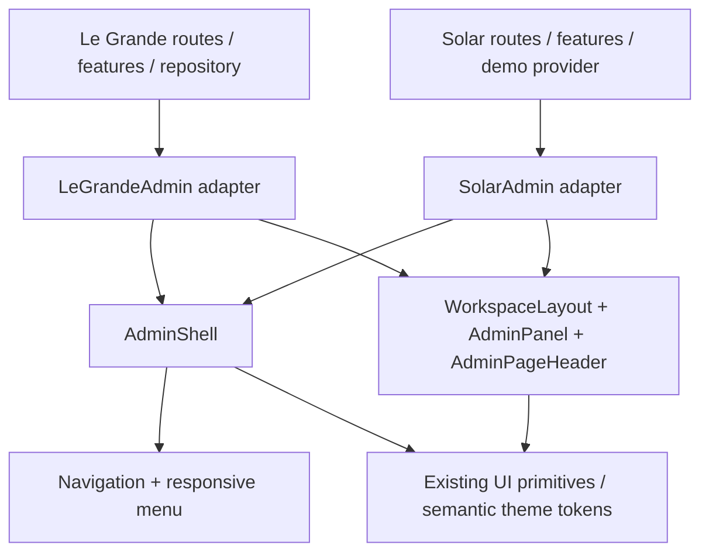

# Architecture Decision — Admin dùng chung cho Le Grande và Solar

Ngày: 06/10/2026. Trạng thái: **kế hoạch chuyển component, chưa triển khai**.
Yêu cầu: gom phần admin thành component nhận props, có các mode bố cục;
cho phép đổi vị trí logo, điều hướng, tab và các vùng làm việc.

## 1. Hiểu: hiện trạng đã đối chiếu

| Nguồn | Snapshot đã đọc | Kết luận |
| --- | --- | --- |
| Le Grande, workspace hiện tại | `57c8620927ebcb56feb58b72fae4c3161a9390c5` | Admin dùng view state, sidebar thu gọn, B2B dossier/list/detail, floor plan. |
| Solar, nhánh local `dev` | `3dac38799421a204e81032266727386eabfc5fee` | Admin có Next routes, `AdminDemoLayout`, `AdminChrome`, context dữ liệu mẫu, role preview. |
| Solar, checkout `/Users/suntech/solar-lxdb` | `main`, `33a41df` | Không có implementation admin trong `src` của checkout này; có docs/captures cũ và output build. Source admin được đọc bằng `git show dev:...`. |
| UI Le Grande | `shopping-mall`, gitlink `9733fee` | Package tên `@mall/ui`. |
| UI Solar trên `dev` | gitlink `6581d71` | Consumer dùng `@solar/ui`; khác checkout UI Solar `7941425`. |

Hai `.gitmodules` cùng trỏ `bangnt188/component-ui.git`. Đã xác nhận `6581d71`
là tổ tiên của `9733fee` trong repository UI local. Điều này không chứng minh
hai phiên bản tương thích: cần review diff, exports và package name trước nâng.
Không lấy output `out/` hoặc source Solar `main` làm baseline thay cho admin `dev`.
Không chuyển branch, sửa Solar hoặc cập nhật submodule trong bước lập kế hoạch.

### So sánh các vùng

| Vùng | Le Grande | Solar `dev` | Phần chung |
| --- | --- | --- | --- |
| Logo | Asset + hai dòng tên, liên kết website | `Brand()` hardcode logo/tên Solar | `brand` props; asset và link do app cấp |
| Sidebar | 224px, rail 76px, menu mobile inline | 232px, mobile menu fixed tại ≤850px | Điều hướng, active item, badge, collapse, focus |
| Header | Breadcrumb + toggle + demo + website | Location + role preview + avatar | Leading/location/actions slots |
| Navigation | Button đổi view | Next `Link` đổi route | Item có destination typed; router adapter |
| Tiêu đề trang | Markup tại workspace | `PageHeading` tại `admin-ui.tsx` | `AdminPageHeader` title/description/actions |
| Panel | CSS global, dossier/request/lease | `Panel` + CSS Module | Header/body/footer có children slots |
| Tabs | Hồ sơ, plan/reference, public/portal | Trạng thái khảo sát dùng `aria-pressed` | Content tabs khác filter buttons |
| List/detail | Nhiều grid/breakpoint, mobile stack/scroll | Lead split, mobile drilldown + back/focus | `WorkspaceLayout` tổ chức hai vùng |
| Theme | Xanh/vàng, nền sáng | Xanh Solar, nền sáng | Semantic tokens; giữ theme từng app |
| State nghiệp vụ | `useAdminData` + repository | `useAdminDemo` + context | Giữ nguyên trong adapter/feature của app |

Đã xem capture Solar `dev:docs/design-evidence/admin-routes/home-desktop.png`
để xác nhận vị trí logo, nav, header, tabs và panel. Đây là evidence đã lưu,
không phải browser verification hiện tại. Render Le Grande mới vẫn chưa có
capture hợp lệ do môi trường chặn preview ở các bước trước.

## 2. Thiết kế: quyết định

Đặt module khung ở **repo component-ui**, export qua entry point `components`.
Không dựng một `AdminEverything` nhận cả lead, lease, floor, catalog và role.
Module có interface nhỏ, giữ hành vi layout/navigation/focus ở một nơi;
hai ứng dụng cung cấp adapter với dữ liệu và hành động riêng.



### Module và seam

| Export đích | Trách nhiệm | Không nhận |
| --- | --- | --- |
| `AdminShell` | Brand, nav, topbar, main, sidebar/rail/mobile menu, focus và skip link | Repository, session, role policy, tenant/lease/catalog DTO |
| `AdminPageHeader` | Title, description, breadcrumb, actions; h1 focus target | Fetch dữ liệu hay quyền thực hiện action |
| `AdminPanel` | Heading, toolbar, body, footer; IDs/landmarks | Một implementation mới của từng màn hình |
| `WorkspaceLayout` | Một vùng hoặc hai vùng; vị trí detail và presentation mobile | Danh sách slot/lead, logic lọc/selected record |
| `Tabs` đã có | Điều hướng giữa các panel nội dung | Điều hướng route hoặc filter trạng thái |
| `ButtonGroup` đã có | Nhóm button filter; controlled value ở app | Tab panel hoặc route navigation |

Dùng lại `Button`, `Avatar`, `Badge`, `Breadcrumbs`, `EmptyState`, `Drawer`
đã có; đọc public exports trước khi viết thêm wrapper. Không tạo lại `Tabs`:
`TabsComponent` hiện được export dưới tên `Tabs`, đã có underline/pill/contained,
orientation, icon/count, controlled value và scrollable.

`Drawer` hiện có trigger riêng, swipeDirection cố định và bố cục generic.
Không mặc định nó đã hỗ trợ menu sidebar trái: khi thực hiện, compose primitive
Base UI hoặc mở rộng primitive đang có với props tối thiểu cần thiết;
không copy một overlay thiếu focus management. Kiểm tra theme inheritance
của portal và trigger tích hợp header.

### Ba mode khung và vị trí item

Mode là **bố cục**, không phải role, theme hay loại nghiệp vụ.

| Mode | Logo desktop | Nav desktop | Header | Mobile |
| --- | --- | --- | --- | --- |
| `sidebar` | Trên cùng sidebar | Dọc; mở rộng hoặc icon rail | Toggle → location → actions/profile | Logo + toggle trên header; nav trong drawer |
| `topnav` | Bên trái header | Hàng ngang phía dưới header | Logo → location → actions/profile | Toggle mở danh sách nav trong drawer |

Default khi migrate cả hai app: `sidebar`. Hai mode còn lại là cấu hình layout
của cùng module, không nhân bản các màn hình. Theme/mật độ vẫn dùng
`data-ui-theme`, `data-ui-scheme`, `data-ui-density`; không tạo `mode="solar"`
hoặc `mode="mall-owner"` bên trong package.

Thứ tự content: page heading → page-level toolbar/tabs nếu có → workspace.
Tab hồ sơ nằm sau header dossier, trước body. Tab plan/reference nằm ngay
trên plan. Filter trạng thái Solar nằm trên danh sách; không gọi nó là tab route.
Các vị trí này đi qua slot component, không nhận tọa độ pixel/absolute position.

```text
Sidebar mode                       Topnav mode
┌─────────┬──────────────────┐     ┌──────────────────────────┐
│ Logo    │ Toggle / Header  │     │ Logo / Header / Actions  │
│ Nav     ├──────────────────┤     ├──────────────────────────┤
│         │ Heading + actions│     │ Navigation               │
│         │ Toolbar / tabs   │     ├──────────────────────────┤
│ Footer  │ List │ Detail    │     │ Heading / tabs / content │
└─────────┴──────────────────┘     └──────────────────────────┘
```

### Interface contract dự kiến

Type dưới đây là design contract, chưa phải export đã triển khai.

```tsx
type AdminShellMode = "sidebar" | "topnav";
type Destination =
  | { kind: "link"; href: string }
  | { kind: "action"; onSelect: () => void };
type AdminNavigationItem = {
  id: string;
  label: string;
  icon?: ReactNode;
  badge?: ReactNode;
  destination: Destination;
};
type AdminShellProps = {
  mode?: AdminShellMode;
  brand: {
    name: string;
    mark: ReactNode;
    description?: string;
    destination?: Destination;
  };
  navigation: readonly AdminNavigationItem[];
  activeItemId: string;
  navigationLabel: string;
  location?: ReactNode;
  headerActions?: ReactNode;
  sidebarFooter?: ReactNode;
  notice?: ReactNode;
  footer?: ReactNode;
  children: ReactNode;
  sidebarCollapsed?: boolean;
  defaultSidebarCollapsed?: boolean;
  onSidebarCollapsedChange?: (collapsed: boolean) => void;
  // Optional router adapter: forwards href, children, aria-current,
  // accessible name, className, ref and click lifecycle to a real anchor.
  renderLink?: AdminLinkRenderer;
};
```

- Controlled `sidebarCollapsed` requires callback; otherwise internal state uses
  `defaultSidebarCollapsed`. Không đổi controlled/uncontrolled giữa phiên.
- Desktop collapse và mobile drawer open là **hai state độc lập**. Resize từ
  mobile không vô tình chuyển desktop sang rail; topnav không có collapse rail.
- IDs nav duy nhất, active ID do app tính. Package không dùng pathname,
  permission hoặc `useRouter`. Item không icon: rail vẫn có fallback đọc được,
  không biến thành button trống.
- Link destination render anchor thật; action render button thật. Solar adapter
  bọc Next Link; Le Grande adapter đổi view state. Adapter không được chặn handler
  đóng mobile menu hoặc làm mất ref/aria-current.
- `mark` nhận logo đã resolve basePath từ app; không hardcode URL, Next Image
  hay tên thương hiệu trong package. Một vị trí brand hiển thị theo breakpoint;
  phần ẩn không được nằm trong tab order.
- Sidebar/nav DOM IDs ổn định và duy nhất, dùng React useId khi không có ID app.
- Thông điệp toggle/open/close/skip là locale strings, có mặc định vi/en; không
  truyền HTML raw. Nội dung label là text, icon trang trí aria-hidden.

`WorkspaceLayout` nhận `primary`, `detail`, `detailSide="start|end"` và
`mobilePresentation="stack|drilldown"`. Với drilldown, nhận controlled
`detailOpen`, `onDetailOpenChange`, `detailLabel`, `returnFocusRef`;
package quản lý Back/focus, app sở hữu selected ID và lọc danh sách.
Không cung cấp component này repository hoặc selected record nguyên khối.

`AdminPanel` nhận `title`, `description`, `action`, `toolbar`, `children`,
`footer`; tabs đi trong toolbar hoặc body tùy scope. `AdminPageHeader` dùng
`title`, `description`, `breadcrumbs`, `actions`. Tái sử dụng `SectionHeading`
ở vị trí phù hợp sau kiểm tra semantics; page header phải có đúng một h1.

### Theme, CSS và responsive

- CSS Modules colocated; không mang `.admin-frame`, `.root button`, `.records-panel td`
  hoặc `body:has(...)` sang library. Tokens semantic từ theme app là seam style.
- Giữ xanh/vàng Le Grande và xanh Solar. Map local variables vào `--ui-*` theo
  scope admin; không đổi theme public khi cần adapter admin sáng.
- Width sidebar, rail, gap/content padding là token component có default;
  không biến từng margin thành prop. Pin Le Grande 224/76 và Solar 232 trong
  adapter trong giai đoạn preserve, rồi mới chốt geometry mặc định chung.
- Mobile breakpoint mục tiêu chung 850px sau preview 800–850px. Migrate ban đầu
  giữ breakpoint incumbent qua token cấu hình build; không dùng CSS custom
  property trong media query. Điểm breakpoint có một nguồn cấu hình static,
  dùng cho cả CSS và matchMedia; kiểm tra mismatch/hydration.
- Mobile drawer có focus trap, Escape, close, backdrop, scroll lock, focus return;
  desktop rail có tooltip cả hover và keyboard focus. Reduced-motion không
  đổi layout hay làm mất nội dung. Touch target ít nhất 44px, input mobile 16px.
- `WorkspaceLayout` chọn stack cho dossier/plan cần xem hai vùng; Solar queue
  có thể dùng drilldown. Không áp mobile filter/tab layout từ một app cho mọi app.
- Tabs không reset form nháp hoặc selection do mount/unmount; state cần giữ
  thuộc feature/provider. Kiểm tra lifecycle primitive trước chuyển tabs hiện có.

## 3. Validate security: threat model

| Rủi ro | Thiết kế kiểm soát |
| --- | --- |
| Nhầm mode/ẩn menu thành quyền | App/server sở hữu permission, DTO và auth. Shell chỉ render items đã cấp; mọi endpoint vẫn authorize. |
| Lộ dữ liệu qua package/demo | Không props session token, secret, DB/R2 clients; fixtures package dùng dữ liệu synthetic. Không ship private payload lên Pages. |
| URL/script injection trong cấu hình menu | Cấu hình menu từ app tin cậy; kiểm tra scheme/destination ở adapter, cấm javascript/data URLs và raw HTML. External links có rel thích hợp. |
| Nhầm logo/record giữa tenant | Brand/context do app resolve; UI preference nếu lưu thì namespace theo app + tenant/user; không lưu hồ sơ hoặc quyền trong preference. |
| Bypass private document access | Viewer/file permissions giữ ở feature/server. Shell không tạo authenticated URL, không lưu/cache file hợp đồng. |
| Route authorization lệch UI | Nav filter chưa đủ: deep link/query/mutation/export đều authorize; role selector Solar vẫn chỉ demo. |
| Supply chain và dependency drift | Gitlink + lockfile pin; review thay đổi package, exports/name, build. Không cập nhật branch floating trong CI. |

Ưu tiên không lưu collapse preference trong bản đầu; state layout giữ trong shell
provider khi đổi route. Auth pages nằm ngoài AdminShell ở adapter Solar, không
đưa password/session logic vào module UI.

## 4. Đề xuất: trade-off và migration path

### Lý do chọn

Hai consumer đã thật sự khác router/theme/content nhưng lặp khung admin,
nav/focus/responsive/panel. Một module chung làm thay đổi layout tập trung,
interface nhỏ vẫn giữ được composition riêng. Không phụ thuộc server để render
khung; production data/auth vẫn thuộc managed runtime/service của mỗi app.

Trade-off: thêm adapter và kiểm tra hai consumer; chuyển CSS global cần xử lý
cascade và DOM semantics. Ba preset giảm cấu hình vô hạn, đổi lại không hỗ trợ
mọi tọa độ hoặc mọi biến thể header chưa có nhu cầu thực tế.

### Batches chuyển đổi

| Batch | Thực hiện | Điều kiện hoàn tất |
| --- | --- | --- |
| 0. Baseline | Capture các trạng thái hiện tại, ghi routes/view/selected/focus; xác nhận Solar dev snapshot và worktree thực hiện | Có bằng chứng desktop/mobile mới của cả hai, không dùng capture cũ cho bản hiện tại |
| 1. Package compatibility | Review delta `6581d71..9733fee`, tên @solar/ui/@mall/ui, exports, peers, token/theme | Chọn một source line dùng chung; cả consumer resolve cùng exports, giữ import name hiện có |
| 2. Core module | Tạo AdminShell/CSS Module, các preset, brand/nav/header slots, mobile drawer/rail | Package preview dùng component thật; đủ 3 mode × 2 theme × open/closed |
| 3. Le Grande shell | Tạo app adapter, chuyển sidebar/topbar/footer/notice ra admin-workspace; giữ useAdminData và features | Nav/rail/mobile, đổi view, slot selection, gọi repository giữ hành vi |
| 4. Solar shell | Tách DemoContext/provider khỏi AdminChrome; adapter Next router/role preview; auth bypass ở app | Provider không remount khi đổi route; dữ liệu phiên và focus không mất |
| 5. Shared composition | Chuyển page headings/panels, WorkspaceLayout, đúng nhóm Tabs/ButtonGroup | Filter/selected/detail đồng bộ, bàn phím, draft, media/object URLs giữ lifecycle |
| 6. CSS cleanup | Xóa CSS khung đã được thay thế từng app, giữ CSS plan/catalog/document; map semantic tokens | Không double style hoặc selector global đè shared module |
| 7. Publish | Publish package commit trước, rồi gitlink/consumer adapters từng app | Ghi rõ commit đạt từng repo; rollback độc lập, không force push |

Đề xuất source line chung là `component-ui/main`, giữ tên package hiện hữu
`@solar/ui` để tương thích Solar trong lần này. Le Grande chuyển import/dependency
`@mall/ui` sang tên chung trong batch compatibility riêng, trước khi thay layout;
review và đưa theme shopping-mall lên source line chung bằng commit có phạm vi.
Tên package chứa Solar không cho phép module import nghiệp vụ Solar. Nếu muốn
đổi tên trung tính, thực hiện migration tên riêng sau khi hai consumer dùng cùng
source line; không đổi package name, theme và shell cùng một batch. Không duy trì
hai implementation AdminShell trên hai nhánh, và không dựa vào workspace alias
chưa được xác minh để che khác biệt tên package.

Vị trí file dự kiến:

```text
component-ui/src/components/layout/
  admin-shell.tsx + admin-shell.module.css
  admin-page-header.tsx + admin-page-header.module.css
  admin-panel.tsx + admin-panel.module.css
  workspace-layout.tsx + workspace-layout.module.css
component-ui/src/components/navigation/
  [shared nav internals; public exports only when another caller needs them]
Le Grande/src/features/admin/le-grande-admin-shell.tsx
Solar/src/features/admin/solar-admin-shell.tsx
Solar/src/features/admin/admin-demo-provider.tsx
```

Rollback: revert adapter batch + gitlink/lockfile về commit trước; giữ provider,
repository và schema. Migration này không đổi database, API URL, auth provider,
public website hay nguyên tắc ghép/giữ slot. Không dùng runtime flag để duy trì
hai implementation shell lâu dài sau khi hoàn tất migration.

### Acceptance matrix cho implementation sau này

- Desktop 1440px mở rộng/rail, intermediate 800/825/850/1024px; mobile390px
  mở/đóng drawer; ba preset và hai theme. Không document overflow; scroll nằm
  đúng vùng tab/table/plan. Logo/nav active/actions hiện đúng vị trí.
- Keyboard: skip/main, toggle, tooltip rail, Escape/close/backdrop/focus return;
  route/view change đưa focus tới heading, không mất draft/provider state.
- Tab nội dung có đúng tablist/tab/tabpanel; filter là button group;
  route nav dùng aria-current, không đóng giả tablist.
- Le Grande: chọn hợp đồng bằng cả row và button, bộ lọc reconcile selection,
  liên kết dossier → lease, ghép liền kề/sảnh, giữ/chuyển/hủy slot, file sample.
- Solar: ADMIN/EDITOR preview, deep link/current item đúng, auth routes không shell,
  lead list/detail/back, catalog create/edit, media object URL cleanup.
- Consumer CSS cascade và theme portal phải được kiểm tra, không chỉ package preview.
- Build/typecheck package + từng app; automated tests chỉ chạy khi được yêu cầu
  trong tác vụ implementation. Không tuyên bố production/auth readiness từ UI pass.

## Nguồn đối chiếu local

- Le Grande: `src/app/admin-preview/admin-workspace.tsx`, `b2b-workspace.tsx`,
  `admin-preview.css`, `b2b-workspace.css`; `src/features/admin/use-admin-data.ts`;
  `PRODUCT.md`, `DESIGN.md`, `docs/admin-architecture-decision.md`.
- Solar **dev**: `src/features/admin/admin-shell.tsx`, `admin-ui.tsx`,
  `admin-screens.tsx`, `admin.module.css`, `src/app/(cms)/admin/layout.tsx`,
  `docs/admin-cms-design.md`, `PRODUCT.md`, `docs/ui-system-architecture.md`.
- UI package: `components/layout`, `navigation/tabs`, `basic/button-group`,
  `feedback/drawer`, `styles/themes/shopping-mall.css`; `.gitmodules` của hai apps.

## Implementation — 06/10/2026

Đã triển khai theo phê duyệt tiếp theo của người dùng:

- Package dùng tên chung `@solar/ui`, nhánh local `feat/shared-admin`, hai consumer cùng pin `d9e8d0d`; theme shopping-mall vẫn opt-in.
- Public exports: `AdminShell`, `AdminPageHeader`, `AdminPanel`, `WorkspaceLayout` cùng các props/types. Hợp đồng dùng trong `packages/ui/docs/admin-layout.md`.
- Le Grande adapter: `src/features/admin/le-grande-admin-shell.tsx`; shell, page heading, dossier workspace, dossier Tabs và preview ButtonGroup đã chuyển sang shared component. Domain repository/state không chuyển vào package.
- Solar adapter/provider/UI: triển khai trên nhánh `refactor/shared-admin`, worktree `/tmp/solar-shared-admin`, tạo từ local dev `3dac387`. Checkout `/Users/suntech/solar-lxdb` đang có thay đổi riêng nên được giữ nguyên.
- Cả hai demo có selector ba mode để duyệt vị trí logo/sidebar/navigation; chọn mode giữ state nghiệp vụ trong cùng phiên.
- Package và hai consumer typecheck thành công; hai static production builds thành công. Chưa chạy hoặc thêm automated tests.
- Đã capture desktop1440/mobile390 cho cả ba mode và rail/menu, rà soát focus Escape và lead mobile drilldown. Detector changed targets không có finding. Final review và bằng chứng lưu `.impeccable/review/shared-*`; trạng thái review cuối được ghi trong báo cáo riêng.
- Chưa push/deploy trong lượt implementation này. Cần publish package revision trước hai consumer khi triển khai; UI demo vẫn không cung cấp auth/API.


### Final review

Reviewer disposition `ship`: hai mục yêu cầu sửa (Solar header overflow và tài liệu stale) được chấm resolved; verdict chỉ bao phủ hai mục này, không phải chứng nhận toàn bộ UI hoặc security production. Cả 12 ảnh mode/viewport có scroll width bằng viewport width; 16 ảnh gồm rail/menu đã mở xác nhận. Package canonical local commit `d9e8d0d` được pin ở cả hai consumer; chưa publish remote.

### Điều chỉnh theo phản hồi

Bỏ preset `header-brand` (Logo trên header) khỏi public type và bộ chọn cả hai app. Hai preset còn lại: `sidebar`, `topnav`. Bằng chứng 3 preset bên trên là lịch sử trước điều chỉnh này.

Phiên bản sau điều chỉnh: hai consumer cùng pin package `a4bcdcd`.

Theo phản hồi mới: active navigation thêm viền 1px và marker cạnh3px (topnav ở cạnh dưới), dùng semantic theme tokens. Hai consumer cùng pin `1523332`.

## Identity correction — 06/10/2026

The shared component has branch-specific package identities: `shopping-mall` is `@mall/ui`; Solar `main` remains `@solar/ui`. The earlier common-name decision in this plan is superseded. Keep consumer imports, workspace scripts, package metadata, and lockfiles aligned on each branch.
