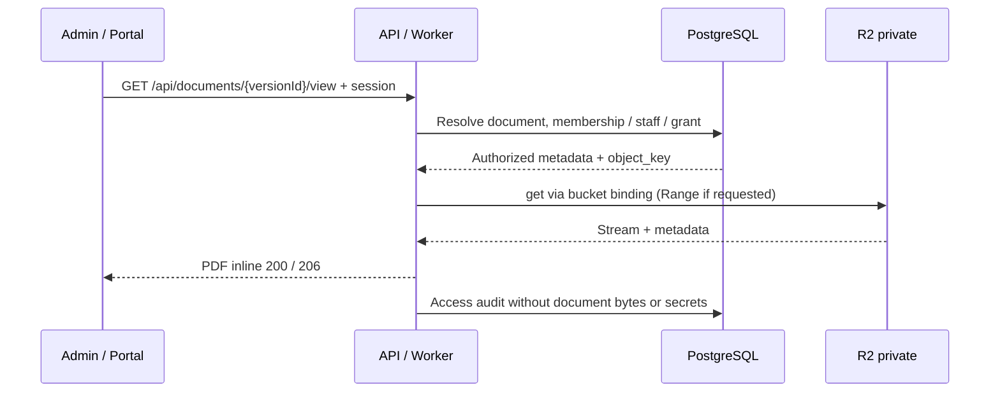

# Architecture Decision — Hợp đồng private trên R2, bắt đầu bằng free tier

Ngày đối chiếu nguồn: 06/10/2026. Quyết định storage/view đã chốt với người dùng.
Trạng thái: design; chưa provision bucket, Worker, session, DB hay file pipeline.

## 1. Hiểu

Tài liệu B2B có hợp đồng, phụ lục, hồ sơ doanh nghiệp, bản vẽ. Hợp đồng có thể chứa
thông tin cá nhân, giá thỏa thuận và chữ ký. Yêu cầu là chỉ đúng người được xem,
giữ nguyên bản ký, có lịch sử và hỗ trợ chuyển nhà cung cấp sau này.

R2 Standard free tier + Workers Free là cấu hình khởi đầu. Mục tiêu free không
được biến tài liệu thành public hoặc bỏ bước kiểm tra quyền khi vượt giới hạn.

## 2. Thiết kế



Endpoint nằm cùng origin với admin/portal hoặc được reverse proxy cùng origin.
Iframe dùng cookie session; không nhét access token vào query string. R2 bucket
không bật r2.dev hoặc custom domain public. Domain Worker không phải custom domain
public của bucket. Worker chỉ đọc bucket qua binding; không có secret ở TSX.

### View contract

`GET /api/documents/{versionId}/view`; có thể hỗ trợ HEAD cho metadata cùng quyền.

- Xác minh session còn hiệu lực và user chưa disabled; không tin company_id client.
- Resolve ID qua DB. Staff cần property + role + permission phù hợp; portal cần
  membership đã xác minh, đúng organization và document grant còn hiệu lực.
- Document của hợp đồng phải đối chiếu lease/organization, không chỉ property.
  Grant không cho phép vượt scope doanh nghiệp; contact CRM không tự có quyền.
- Chỉ xem version scan_state=clean và đáp ứng trạng thái publish/seal tương ứng.
- Quyền GET/HEAD/Range giống nhau. Request không có quyền không tiết lộ metadata;
  chọn thống nhất 403 hoặc 404 cho IDOR, 401 cho phiên hết hạn.
- Resolve object_key phía server. Không có endpoint đọc key tùy ý từ URL client.
- Hỗ trợ full GET 200, single Range 206, Content-Range/Content-Length chính xác,
  range không hợp lệ 416, Accept-Ranges: bytes. Nếu không hỗ trợ multi-range,
  bỏ qua Range và trả full 200 theo HTTP; không giả trả 206 cho dữ liệu full.
- Không dùng memory buffer toàn file. R2 body stream; xử lý disconnect đúng cách.
- API design chưa có handler, chưa kiểm thử PDF viewer/session/Range thực tế.

Headers đề xuất cho PDF đã kiểm tra:

```http
Content-Type: application/pdf
Content-Disposition: inline; filename="contract.pdf"
Cache-Control: private, no-store
X-Content-Type-Options: nosniff
Referrer-Policy: no-referrer
```

Tên file thực tế phải sanitize/encode, không nội suy header từ tên upload tùy ý.
`Content-Length` là số byte phần được trả nếu 206. CSP của trang viewer giới hạn
frame-src vào endpoint hợp lệ, hạn chế embedding từ origin khác. Không dùng route
PDF để render HTML/SVG/DOCX upload tùy ý; DOCX cho download hoặc converter đã bảo vệ.

Audit ghi actor, document/version ID, action, timestamp/result; có thể gom các
Range requests trong phiên xem để tránh ghi một event cho mỗi chunk. Thông báo
lỗi và telemetry không chứa bytes, cookie, signed URL hoặc nội dung hợp đồng.

### Presigned URL: chỉ khi chính sách download cho phép

API kiểm tra quyền trước khi ký GET một object cụ thể. TTL ngắn theo policy,
ví dụ 60–300 giây là đề xuất kỹ thuật, chưa phải policy được người dùng chốt.
Signed link là bearer credential, người cầm link có thể dùng lại trước expiry;
không gắn với session, không mặc định dùng một lần. Không lưu link vào DB hoặc log.

R2 presigned URL dùng S3 API domain, không dùng trực tiếp với custom domain bucket.
CORS chỉ hỗ trợ browser access và không thay authorization. Revoke session không
lập tức vô hiệu một signed link đã cấp; chọn Worker view để kiểm tra quyền trên
request mới. Bản đã tải hoặc bytes đang xem không thể thu hồi từ phía người dùng.

### Upload và phiên bản

1. API xác thực quyền upload, quota và loại tài liệu; tạo metadata pending.
2. Cấp quyền upload vào key quarantine mới, không ghi đè key của file đã ký.
3. Backend xác nhận bytes, kích thước, file signature/MIME, hash và kết quả quét.
   Content-Type do browser gửi chưa đủ để chứng minh nội dung an toàn.
4. Chuyển file sạch sang key immutable mới trong vùng protected, cập nhật clean;
   verify signed PDF riêng khi cần. Không biến đổi bytes original đã ký.
5. Liên kết document version vào lease version trước khi đánh dấu signed/sealed.
   Đóng băng metadata bytes; retention/legal hold quản lý ở bảng riêng.
6. Preview/conversion là derivative riêng, cùng quyền private; không public CDN.

Quét virus/OCR/conversion không chạy trong Worker Free view endpoint. Phải chọn
cách xử lý riêng trước production; chưa xác nhận dịch vụ đó miễn phí. Nếu chưa
có kết quả sạch, file không được phục vụ. Upload pipeline async dùng outbox/event
idempotent; DB transaction không bao gồm R2 atomic commit. Có finalize/cleanup
orphan với reconciliation; cleanup phải tôn trọng retention và legal hold.

### Database contract

- documents: property/organization, classification, title.
- document_versions: version_number, provider, bucket, object_key, MIME, bytes,
  SHA-256, scan_state, uploader, uploaded_at, sealed_at.
- document_retention: retention_until, legal_hold, policy_reference, approver.
- document_access_grants: user/document, người cấp, expiry/revocation.
- lease_documents/plan_documents: FK typed tới version; không dựa vào tên file.

Phiên bản do ứng dụng quản lý bằng record + object_key mới cho mỗi version.
Không mặc định R2 hỗ trợ S3 object versioning/version_id. Khi thay storage, giữ
provider adapter và document ID, chuyển bytes + kiểm tra hash, cập nhật location
có audit; không đổi URL giao diện theo provider.

### Retention và backup

R2 bucket locks có thể chặn delete/overwrite theo prefix/thời hạn. Không tự bật
indefinite lock; retention phải do pháp chế/owner duyệt, tách người có quyền sửa
bucket lock khỏi runtime đọc file. Quy tắc có thể bị người đủ quyền cấu hình thay
đổi; không mô tả bucket lock là bằng chứng WORM pháp lý không thể bypass.

Replication/durability của provider không thay backup độc lập. Lập bản sao private
và restore plan cho file + metadata. Tổng bytes backup/versions/quarantine nếu
cùng tài khoản R2 được tính vào quota; không hứa backup miễn phí hay đã tồn tại.
Chưa chốt RPO/RTO, lịch backup hoặc thời hạn lưu; ghi là production gate.

### Hạn mức free và điều kiện đáp ứng

| Thành phần | Free hiện tại | Hệ quả thiết kế |
| --- | --- | --- |
| R2 Standard | 10 GB-month/tháng | Tính cả original, phụ lục, phiên bản, preview/quarantine và backup cùng tài khoản |
| R2 Class A | 1 triệu operation/tháng | Upload/copy/list/multipart có thể dùng nhiều operation mỗi file |
| R2 Class B | 10 triệu operation/tháng | HEAD/GET và từng lần đọc Range tăng số operation |
| R2 egress | Không tính phí egress | Không có nghĩa storage/operations vượt quota miễn phí |
| Workers Free | 100.000 request/ngày, 10 ms CPU/request | Auth/DB/stream phải đo thực tế; không quét file/SSR nặng trong viewer |

Free tier R2 chỉ áp dụng Standard, không áp dụng Infrequent Access. R2 cần bật
subscription/checkout và tính phí usage vượt mức; đây không phải hard cap tự ngắt
ở 10 GB. Workers Free có giới hạn request/CPU, không bảo đảm availability khi vượt.
Thời gian chờ network không tính CPU, nhưng verify token, xử lý payload/hash có
CPU cost. Một lượt xem PDF có thể nhiều HTTP/Range requests.

Ước tính minh họa: 1.000 file × 5 MB ≈ 5 GB trước phụ lục/versions/backup. Đây là
capacity estimate, không phải số liệu dự án hay cam kết đáp ứng. Quota dùng chung
các workloads trong account cần được kiểm tra khi provisioning.

Đề xuất cảnh báo 70%/85%, ngưỡng upload dự phòng dưới quota và đo request/CPU;
đây là policy đề xuất chưa tự kích hoạt. Vượt ngưỡng upload có thể trả lỗi quota
và giữ quyền đọc dữ liệu đã có. Monitoring/alerts không phải cost ceiling tuyệt
đối: retries, concurrent requests và dịch vụ khác vẫn có thể tạo usage. Rate-limit
read tránh abuse; không list bucket để làm trang tài liệu, query DB có phân trang.

Phạm vi xác nhận: free có các primitive private storage/binding/presigned cần
cho thiết kế. Chưa chứng minh auth/DB/scan/backup/traffic của toàn hệ thống đều
nằm free. Nếu 10 ms không đáp ứng sau khi đo, cần nâng gói hoặc đổi runtime cùng
contract; không bỏ authorization, audit hay quét file để giảm CPU.

## 3. Validate security và pháp lý

Threat model: link leakage, session theft, IDOR chéo doanh nghiệp, public bucket
bypass, cached PDF, file độc hại, overwrite bản ký và chi phí do abuse.

Kiểm soát: deny by default, role/property/org/object checks; private bucket; server
mapping key; no-store/no public Cache API; strict session/CSRF cho mutation;
quarantine và integrity; immutable keys; quota/rate limit; access audit redacted.

Cloudflare location hint không phải cam kết residency. Jurisdiction restriction
của provider cần được chọn/xác nhận nếu nghĩa vụ yêu cầu; lưu trữ, backup, Worker
xử lý và subprocessors phải cùng được rà soát. Free plan không tự bảo đảm tuân thủ.
Pháp chế xác nhận DPA, căn cứ xử lý/chuyển dữ liệu, thời hạn lưu và legal hold.
Lưu cloud không tự xác minh chữ ký hoặc hiệu lực pháp lý của hợp đồng.

## 4. Đề xuất và migration

Triển khai R2 Standard private + Worker view trên free tier trước pilot có kiểm
soát. Giữ endpoint version ID và adapter storage; scope bucket/read credentials
riêng cho viewer và write/cleanup role. Không dùng tài khoản quản trị storage ở
runtime. Backend DB/auth phải có trước khi phục vụ tài liệu thật.

Các gate: auth/RLS, cross-org access checks, scan/finalize, Range/HEAD viewer,
CPU/quota measurements, signed PDF verification, backup/restore, privacy review.
Chưa tạo tài nguyên và không có lệnh deployment/apply tự động trong docs này.

## Nguồn chính thức

- [R2 pricing](https://developers.cloudflare.com/r2/pricing/).
- [Workers pricing](https://developers.cloudflare.com/workers/platform/pricing/) và
  [limits](https://developers.cloudflare.com/workers/platform/limits/).
- [R2 subscription setup](https://developers.cloudflare.com/r2/get-started/).
- [R2 presigned URLs](https://developers.cloudflare.com/r2/api/s3/presigned-urls/).
- [R2 Workers API, streaming và ranged reads](https://developers.cloudflare.com/r2/api/workers/workers-api-reference/).
- [R2 bucket locks](https://developers.cloudflare.com/r2/buckets/bucket-locks/).
- [S3 API compatibility](https://developers.cloudflare.com/r2/api/s3/api/).
- [R2 data location](https://developers.cloudflare.com/r2/reference/data-location/).
